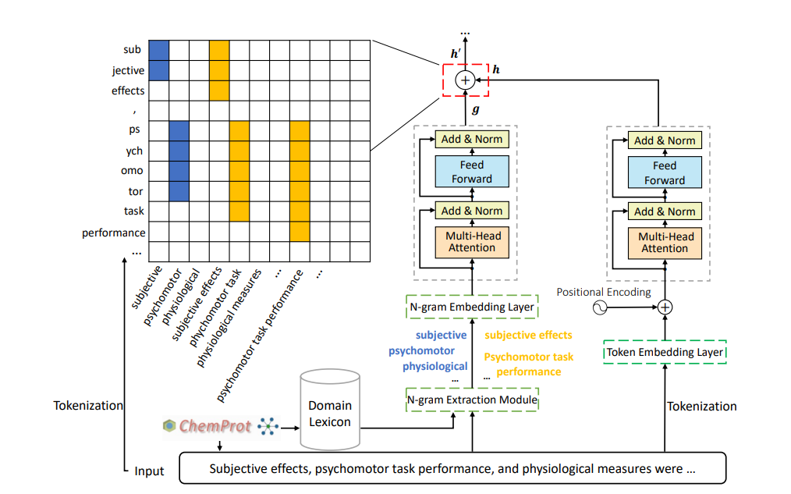

# T-DNA
Source code for the ACL-IJCNLP 2021 paper entitled [Taming Pre-trained Language Models with N-gram Representations for Low-Resource Domain Adaptation](https://aclanthology.org/2021.acl-long.259.pdf).

Our implementation is built on the source code from [huggingface transformers](https://github.com/huggingface/transformers).

## Model

We aim to adapt a generic pretrained
model with a relatively small amount of
domain-specific data. We demonstrate that by
explicitly incorporating the multi-granularity
information of unseen and domain-specific
words via the adaptation of (word based) n-grams, the performance of a generic pretrained
model can be greatly improved. Specifically,
we introduce a **T**ransformer-based **D**omain-aware **N**-gram **A**daptor, **T-DNA**, to effectively
learn and incorporate the semantic representation of different combinations of words in
the new domain. T-DNA is able to achieve significant improvements compared to existing
methods on most tasks using limited data with
lower computational costs.

The overall architechture of T-DNA is shown in the figure below. 


## Requirements

Our code works with the following environment.
* `python=3.7.9`
* `pytorch=1.4.0`

To install the necessary packages for the project, please run: `pip install -r requirements.txt`.


## Quick Start (For reproducing results)

1. To do RoBERTa+T-DNA+FT, please refer to `auto_FT.sh` and you can simply run `CUDA_VISIBLE_DEVICES=<GPU_ID> bash auto_FT.sh` and get the expected results:
```angular2html
09/08/2021 19:56:58 - INFO - __main__ -   ***** Test results ag *****
09/08/2021 19:56:58 - INFO - __main__ -     eval_loss = 0.4393280267715454
09/08/2021 19:56:58 - INFO - __main__ -     eval_acc_and_f1 = {'acc': 0.8889473684210526, 'f1': 0.8889374532466023, 'acc_and_f1': 0.8889424108338275}
```

2. To do RoBERTa+T-DNA+TAPT, please refer to `auto_TAPT.sh` and you can simply run `CUDA_VISIBLE_DEVICES=<GPU_ID> bash auto_TAPT.sh` and get the expected results:
```angular2html
09/08/2021 19:47:03 - INFO - __main__ -   ***** Test results ag *****
09/08/2021 19:47:03 - INFO - __main__ -     eval_loss = 0.48006332549609637
09/08/2021 19:47:03 - INFO - __main__ -     eval_acc_and_f1 = {'acc': 0.8943421052631579, 'f1': 0.8939718422143115, 'acc_and_f1': 0.8941569737387347}
```

3. Important arguments:
   * `task_name`: `ag`, `amazon`, `citation_intent`, `chemprot`, `hyperpartisan_news`, `imdb`, `rct-20k`, `sciie`
   * `data_dir`: path of processed data 
   * `output_dir`: path of saved results

## Datasets

Following [**Gururangan et al. (2020)**](https://arxiv.org/abs/2004.10964), we conduct our experiments on eight classification tasks from four domains including biomedical sciences, computer scie nce, news and reviews. They are: 
* **ChemProt**: a manually annotated chemical–protein interaction dataset extracted from 5,031 abstracts for relation classification;
* **RCT**: contains approximately 200,000 abstracts from public medicine with the role of each sentence clearly identified;
* **CitationIntent**: contains around 2,000 citations annotated for their function;
* **SciERC**: consists of 500 scientific abstracts annotated for relation classification; 
* **HyperPartisan**: which contains 645 articles from Hyperpartisan news with either extreme left-wing or right-wing stand-point used for partisanship classification;
* **AGNews**: consists of 127,600 categorized articles from more than 2000 news source for topic classification;
* **Amazon**:  consists of 145,251 reviews on Women’s and Men’s Clothing & Accessories, each representing users’ implicit feedback on items with a binary label signifying whether the majority of customers found the review helpful; 
* **IMDB**:  50,000 balanced positive and negative reviews from the Internet Movie Database for sentiment classification


The datasets can be downloaded from [the code associated with the Don't Stop Pretraining ACL 2020 paper](https://github.com/allenai/dont-stop-pretraining).
Please create a folder `./data` in the root directory and put the downloaded datasets into it.
After downloading, please convert them to *`.tsv` files referring to the script [convert_dont_stop_corpus.py](./data/convert_dont_stop_corpus.py).
Note that to create a low-resource setting, we constrain the size of all datasets into thousand-level. To do so, we randomly select a subset for RCT, AG, Amazon, IMDB with the ratio 1%, 1%, 1%, 10%, respectively.

To extract n-grams for datasets, please run `pmi_ngram.py` with the following parameters:
   * `--dataset`: the path of training data file
   * `--output_dir`: the path of output directory


## Use with your own data
In this repo, we conducted experiments on eight classification tasks as described in the paper.
In addition, it supports any classification task with just a little adjustment on your dataset.
Here are the instructions to conduct experiments with your own data.

Firstly, please adjust your data format as following and put your data into the corresponding path.
### Task adaptive pre-training:

Input dataset (`./data/`):
  * train: `text \t label` per line 
  * dev: `text \t label` per line 

Output: it will save the trained models to `results` folder automatically, and print out `loss`.

### Fine-tuning dataset:
Input dataset (`./data/tapt_data/`):
* train: `text \t label` per line 
* dev: `text \t label` per line 
* test: `text \t label` per line 


Then, please modify the configuration file at `./TDNA/config.py`
1. define the desired evaluation metric in `glue_compute_metrics()`, e.g.,
```angular2html
elif task_name == "ag":
   return {"acc_and_f1": acc_and_f1(preds, labels)}
```
2. create a new processor specifying the labels, e.g.,
```angular2html
class agProcessor(generalProcessor):
    def get_labels(self):
        return ['1', '2', '3', '4']
```
3. specify the number of labels, e.g.,
```angular2html
glue_tasks_num_labels = {
    "citation_intent": 6,
    "ag": 4,
    "amazon": 2,
    "chemprot": 13,
    "hyperpartisan_news": 2,
    "imdb": 2,
    "rct-20k": 5,
    "sciie": 7,
    "SST2": 2
}
```

4. include the new processor into glue_processors, e.g.,
```angular2html
glue_processors = {
    "citation_intent": citation_intentProcessor,
    "ag": agProcessor,
    "amazon": amazonProcessor,
    "chemprot": chemprotProcessor,
    "hyperpartisan_news": hyperpartisan_newsProcessor,
    "imdb": imdbProcessor,
    "rct-20k": rct_20kProcessor,
    "sciie": sciieProcessor,
    "SST2": SST2Processor
}
```
5. specify the output mode in glue_output_modes, e.g.,
```angular2html
glue_output_modes = {
    "citation_intent": "classification",
    "ag": "classification",
    "amazon": "classification",
    "chemprot": "classification",
    "hyperpartisan_news": "classification",
    "imdb": "classification",
    "rct-20k": "classification",
    "sciie": "classification",
    "SST2": "classification"
}
```

### Run
For `FT`,
```angular2html
python ./examples/run_classification.py --model_name_or_path roberta-base \
--task_name <task_name> --max_seq_length 256 --per_device_train_batch_size 16 \
--learning_rate 4e-5 --num_train_epochs 3.0 --output_dir ./results/<task_name>_FT/ \
--data_dir ./data/<task_name>/ --Ngram_path ./ngram/pmi_<task_name>_ngram.txt \
--fasttext_model_path ./ngram/<task_name>.npy --overwrite_output_dir
```
For `TAPT + FT`,
```angular2html
python ./examples/run_language_modeling.py \
--output_dir=./models/<task_name>_TAPT/ --model_type=roberta  --overwrite_output_dir \
--model_name_or_path=roberta-base --train_data_file=./data/tapt_data/<task_name>/train.tsv \
--eval_data_file=./data/tapt_data/<task_name>/dev.tsv --mlm --line_by_line \
--Ngram_path ./ngram/pmi_<task_name>_ngram.txt --num_train_epochs 10.0 \
--fasttext_model_path ./ngram/<task_name>.npy --learning_rate 4e-5

python ./examples/run_classification.py \
--model_name_or_path ./models/<task_name>_TAPT \
--task_name <task_name> --max_seq_length 256 --per_device_train_batch_size 16 \
--learning_rate 2e-5 --num_train_epochs 5.0 --output_dir ./results/<task_name>_TAPT_FT/ \
--data_dir ./data/<task_name>/ --Ngram_path ./ngram/pmi_<task_name>_ngram.txt --overwrite_output_dir --save_steps 5000
```

### Output: 
The `run_classification.py` program will save the trained models to `results` folder automatically, and print out `loss`, `accuracy`, `f1 score`.
In addition, you can get the prediction results in `args.output_dir/test_pred_{task_name}.txt`. Take `test_pred_ag.txt` as an example:
```angular2html
input   label   pred
Unions representing workers at Turner   Newall say they are 'disappointed' after talks with stricken parent firm Federal Mogul. 3       3
SPACE.com - TORONTO, Canada -- A second\team of rocketeers competing for the  #36;10 million Ansari X Prize, a contest for\privately funded suborbital space flight, has officially announced the first\launch date for its manned rocket.      4       4
...
```

## Contact information

For help or issues using T-DNA, please submit a GitHub issue.

For personal communication related to T-DNA, please contact Shizhe Diao (`sdiaoaa@connect.ust.hk`).

## Citation

If you use or extend our work, please cite the following paper:
```
@inproceedings{DXSJSZ2021,
    title = "Taming Pre-trained Language Models with N-gram Representations for Low-Resource Domain Adaptation",
    author = "Diao, Shizhe  and
      Xu, Ruijia  and
      Su, Hongjin  and
      Jiang, Yilei  and
      Song, Yan  and
      Zhang, Tong",
    booktitle = "Proceedings of the 59th Annual Meeting of the Association for Computational Linguistics and the 11th International Joint Conference on Natural Language Processing (Volume 1: Long Papers)",
    month = aug,
    year = "2021",
    address = "Online",
    publisher = "Association for Computational Linguistics",
    url = "https://aclanthology.org/2021.acl-long.259",
    doi = "10.18653/v1/2021.acl-long.259",
    pages = "3336--3349",
}
```

